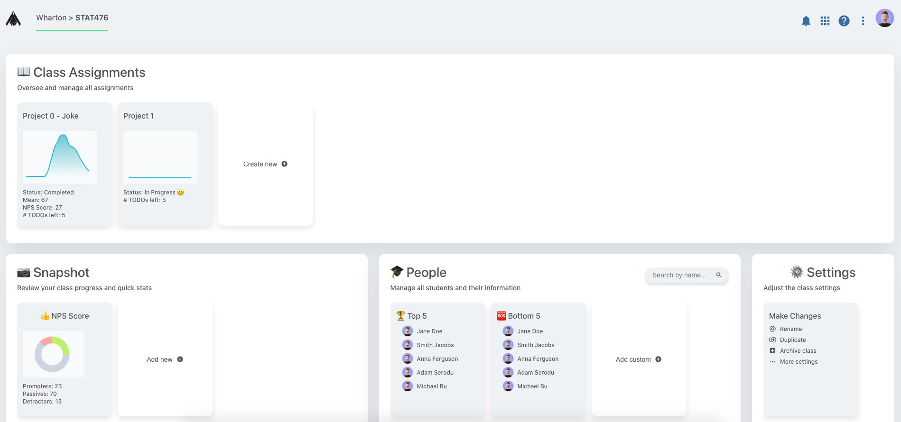

# Dashboard App

Dashboard web application developed with React Js.

## Table of contents

- [Overview](#overview)
  - [Screenshot](#screenshot)
  - [Built with](#built-with)
- [Introduction](#introduction)
  - [User Interface](#user-interface)
  - [Functionality](#functionality)
- [Author](#author)

## Overview

### Screenshot

### Built with

Languages:

- React JS
- HTML / CSS / Javascript

Concepts:

- Flexbox - CSS Grid
- CSS Modules
- Responsive Design
- Desktop-First

## Introduction

Assignments / Class Dashboard Web App

Some Features:

- Responsive design
- Adding New Projects
- Deleting Projects

### User Interface

There are 5 main components:

1. Header: The header part at the top of the application
2. Class Assignments: The assignments section consists of projects.
3. Snapshot: The snapshot section consists of NPS Scores.
4. People: The people section consists of top and bottom students.
5. Settings: The setting section consists of, well, settings.

### Functionality

Adding Projects: Projects can be added to the assignments from the modal.  
Deleting Projects: Projects can be deleted from the assignments.

## Author

Erke Canbazoğlu

- Linkedin - [Erke Canbazoğlu](https://www.linkedin.com/in/erkecanbazoglu/)
- Github - [erkecanbazoglu](https://github.com/erkecanbazoglu)
